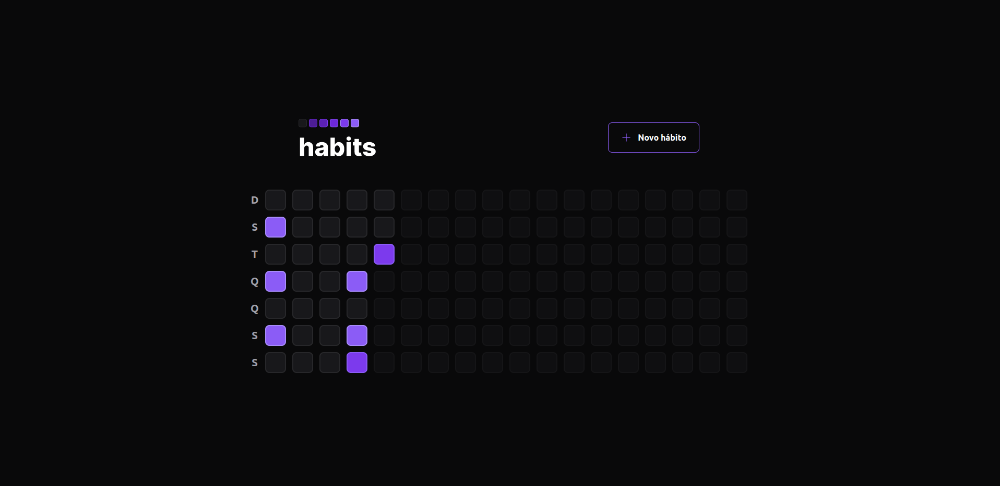
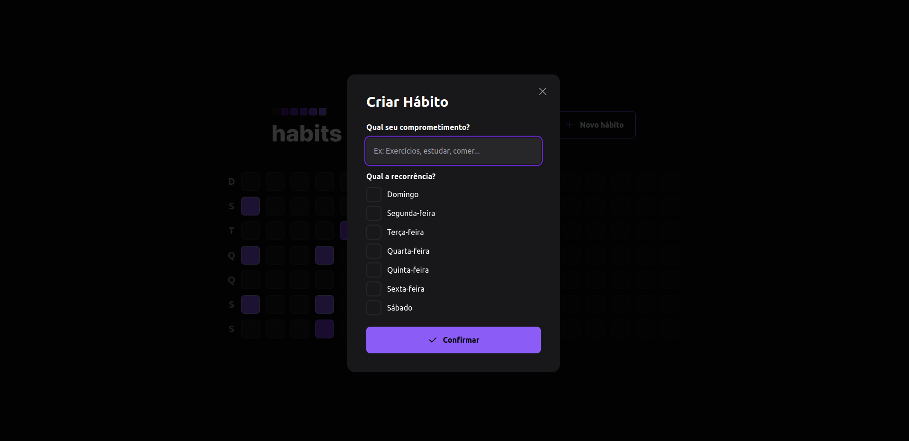
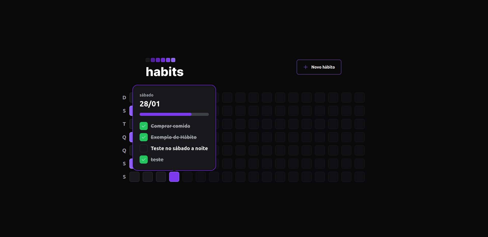
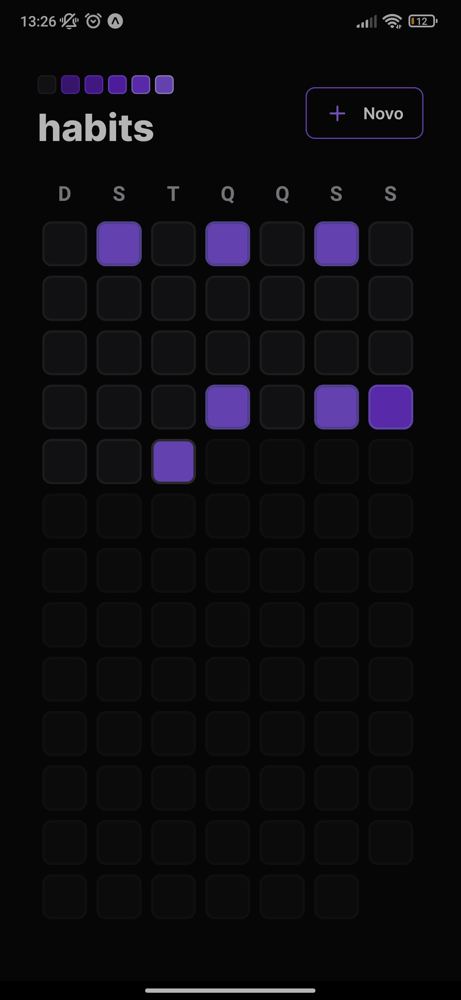
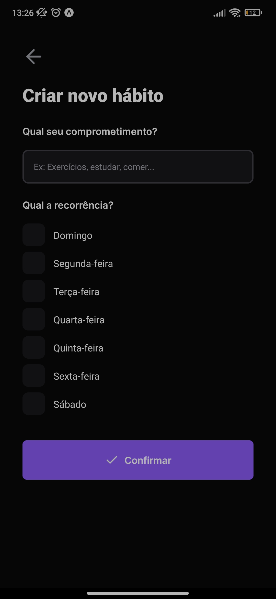
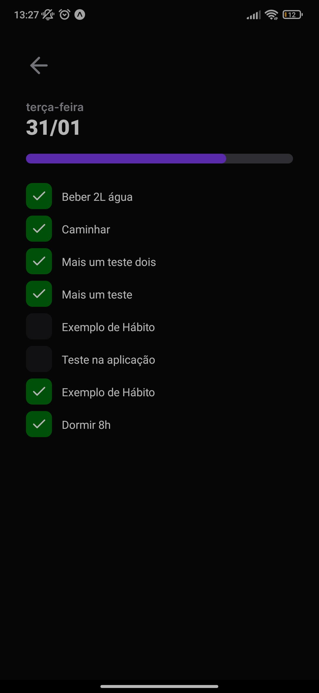

# NLW Setup

Projeto desenvolvido durante o evente, no qual consiste em um sistema para criar e gerenciar os hábitos diários. O projeto consta com um site construído com React, um app mobile desenvolvido com React Native e o backend desenvolvido com Node.js e Fastify.

## WEB

## MOBILE

